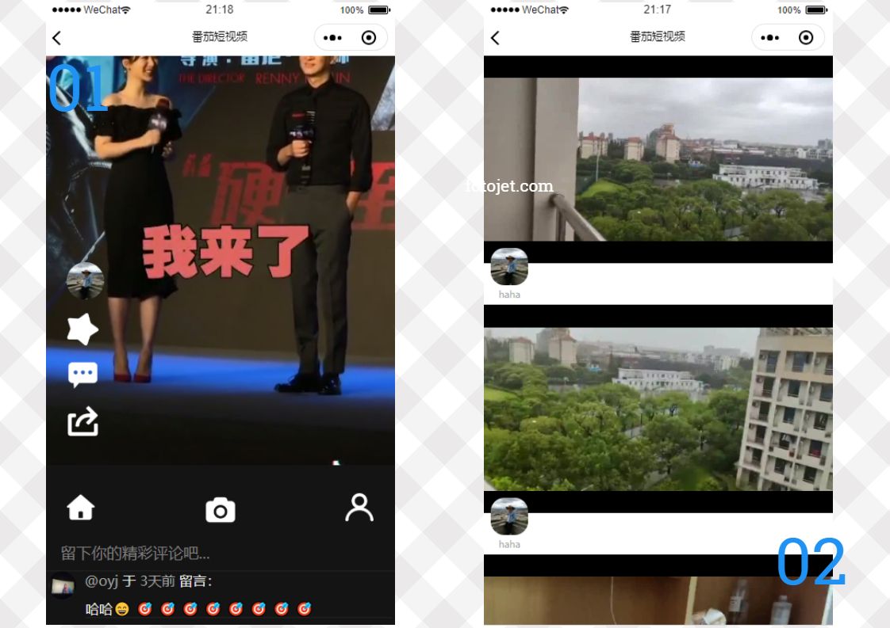
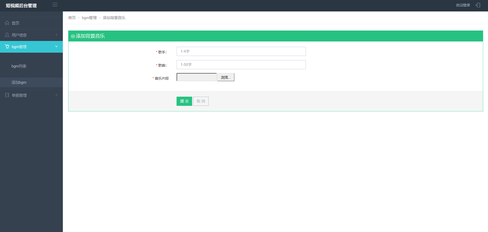
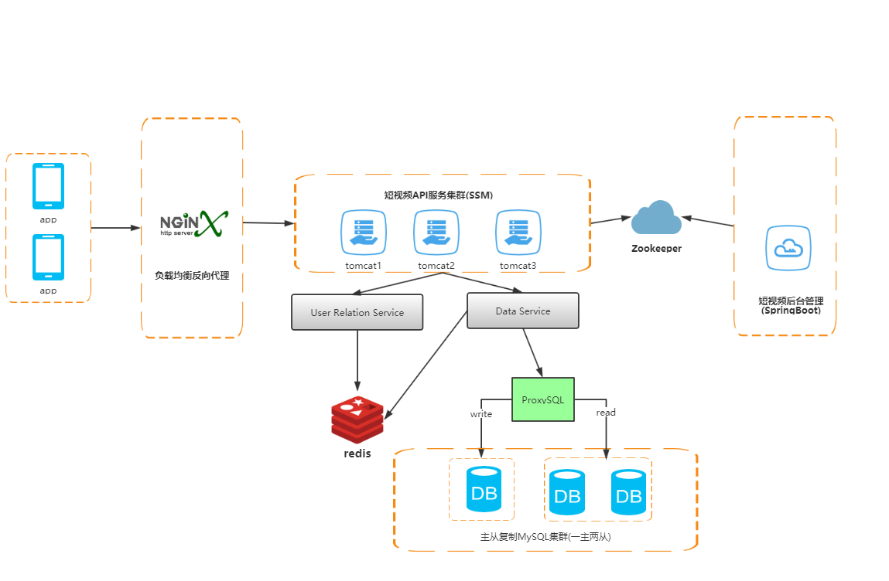
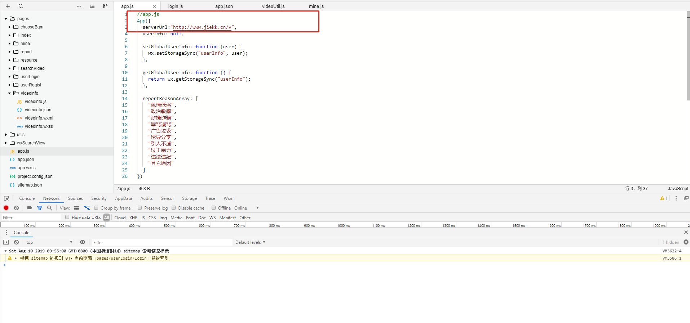
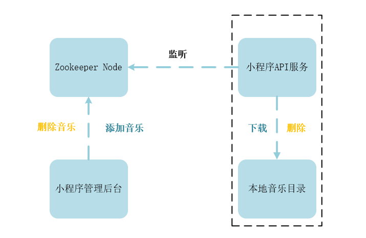

⭐⭐⭐⭐番茄短视频-后台管理系统🙋基于SpringBoot搭建🐓 关键字：SSM、springboot、分布式、前后端分离、云部署、Zookeeper、redis
#
<h2>☁️线上版(备案中......)</h2>

<blockquote>

简介：基于风口飞起的两只"小猪🐖"——小程序+短视频,该项目是一款基于微信小程序端的视频社交软件,并且采用腾讯云的服务器进行分布式的部署~~~

小视频后台管理系统 —— 主要实现了用户的管理，短视频的管理，背景音乐的管理，权限验证，单点登陆。

微信小程序端 —— 短视频社交小程序，用户可以在小程序上发布自己的短视频，并且经过我们的平台加入滤镜（功能暂未上线）或者背景音乐制作出独具特色的短视频。实现了点赞、评论、下载、分享、转发（接口未开放）等功能。

微信小程序API的后台Github地址：https://github.com/oyjcodes/wx-videos-api

微信小程序前端APP的Github地址：https://github.com/oyjcodes/wx-video-client

</blockquote>


<h2>💡小程序端展示</h2>


<br>



<h2>💻后台管理系统页面展现</h2>


 

  
<h2>✏️项目需求及设计</h2>
<h3>微信小程序端</h3>
<p>APP前端：基于微信小程序的开发文档</p>
<p>API后端：基于SSM  +  ProxySQL  +  mysql数据库  +  redis缓存数据库  +  ffmpeg音视频工具 + zookeeper分布式一致性服务</p>
<p>组件：wxsearch微信小程序搜索组件</p>
<p>功能：实现了视频上传(手机视频拍摄、选取本地视频)、浏览、热点关键词检索、点赞、评论、关注、举报、下载、分享、转发（接口未开放）等功能。</p>

<h3>后台管理系统端</h3>
<p>网站前端：bootstrap前端框架 + javascript + css +html +jquery +ajax+themeleaf模板引擎 </p>
<p>网站后端：SpringBoot快速开发框架 + mysql数据库 +  zookeeper分布式一致性服务</p>
<p>短视频：审核、删除</p>
<p>背景音乐：添加和修改</p>
<p>管理员管理：用户管理、视频访问量、点击率的记载分析(开发中......)</p>
 

<h2>☕️系统架构</h2>



<h2>🍉Tip</h2>

<p>将wx-videos-client小程序页面导入到微信开发工具栏中,并且在app.json文件中修改serverUr服务器地址</p>
<p>如需使用本地api需要部署wx-videos-dev项目（项目以war包发布，需要额外配置tomcat环境）</p>
<p>关于后台管理系统 导入wx-videos-admin项目</p>
<p>关于分布式zookeeper环境配置，观看相关的配置文件即可</p>


<h2>运行环境</h2>
<p>本系统运行在三台云服务器上，实现分布式部署。<p>
<table>
<thead>
<tr>
<th>服务器名</th>
<th>部署</th>
</tr>
</thead>
<tbody>

<tr>
<td>Server1</td>
<td>微信小程序后台API(SSM搭建)</td>
</tr>
<tr>
<td>Server2</td>
<td>Zookeeper</td>
</tr>

<tr>
<td>Server3</td>
<td>短视频后台管理(springBoot)搭建</td>
</tr>
</tbody>
</table>
 
<h2>性能测试</h2>

<p>使用 Apache的ab(apachebench)工具来进行压力测试</p>

ab命令会创建多个并发访问线程，模拟多个访问者同时对某一URL地址进行访问。

ab命令对发出负载的计算机要求很低，它既不会占用很高CPU，也不会占用很多内存。但却会给目标服务器造成巨大的负载，其原理类似CC攻击。

为了防止网络时延的影响，因此在服务器端运行 ab 工具进行测试。其中 -c 参数为并发数，-n 参数为请求数，-k 参数表示持久连接，http://127.0.0.1/v就是待测试的网站。

```
ab -c 1000 -n 6000 -k http://127.0.0.1/v
```

<p>原始架构：没有采用Redis缓存以及主从架构来实现读写分离，测试的部分结果如下：平均每秒的请求数为 635.21。</p>

```
Time taken for tests:   6.985 seconds
Total transferred:      2645529 bytes
HTML transferred:       1530306 bytes
Requests per second:    635.21 [#/sec] (mean)
```

<p>架构升级：使用Redis缓存以及主从架构之后，测试的结果如下：平均每秒的请求数提高到了4678.72，大大提高了网站的吞吐量。</p>

```
Time taken for tests:   1.033 seconds
Total transferred:      2696313 bytes
HTML transferred:       1559682 bytes
Requests per second:    4678.72 [#/sec] (mean)

```
<h2>分布式一致性</h2>

<h3>集中式</h3>

部署结构简单（因为基于底层性能卓越的大型主机，不需考虑对服务多个节点的部署，也就不用考虑多个节点之间分布式协调问题）

<h3>分布式的特点</h3>

分布式系统是一个硬件或软件组件分布在不同的网络计算机上，彼此之间仅仅通过消息传递进行通信和协调的系统。
分布性：在空间随意分布
对等性：没有主从之分，都是对等的
并发性
缺乏全局时钟：很难定义两个事件谁先谁后
故障总是会发生
 

<h3>分布式环境的各种问题</h3>

通信异常：主要是因为网络本身的不可靠性
网络分区：当网络发生异常时，导致部分节点之间的网络延时不断增大，最终导致部分节点可以通信，而另一部分节点不能。
三态（成功、失败与超时）
节点故障：组成分布式系统的服务器节点出现宕机或“僵死”现象
 
<h3>Paxos算法</h3>

算法中的参与者主要分为三个角色，同时每个参与者又可兼领多个角色:

　　proposer 提出提案，提案信息包括提案编号和提议的value;

　　acceptor 收到提案后可以接受(accept)提案;

　　learner 只能"学习"被批准的提案;

阶段一：

　　Proposer选择一个提案编号Mn，向Acceptor的某个超过半数的子集成员发送编号为Mn的Prepare请求

　　如果一个Acceptor收到一个Mn的请求，且Mn大于它已经响应的所有请求的编号，它会将它已批准过的最大编号的提案作为响应反馈给Proposer，同时它承诺不会再批准任何编号小于Mn的提案

　　比如一个Acceptor已经响应过的提案编号分别为1,2,7，那么它在收到一个编号为8的Prepare请求后，会将编号为7的提案反馈给Proposer

阶段二 ：

　　如果Proposer收到半数以上的Acceptor的响应，它会发一个针对[Mn，Vn]提案的Accept请求给Acceptor。Vn是收到响应中编号最大提案的值，如果响应中不包含任何提案，那么它就是任意值

　　如果Acceptor收到这个针对[Mn，Vn]提案的Accept请求，只要它尚未对编号大于Mn的Prepare请求做出响应，它就可以通过这个提案

提案获取：

　　方案一：一旦 Acceptor批准了一个提案，就发送给所有Learner

　　方案二：批准的提案先发给主Learner，再由其同步给其他Learner。（主Learner可能出现故障）

　　方案三：批准的提案先发给一个特定的Learner集合，再由集合里的Learner通知其他Learner。


<h2>ZooKeeper与Paxos</h2>

<h3>ZooKeeper的ZAB协议</h3>

　　ZooKeeper并没有完全采用Paxos算法，而是采用一种称为ZooKeeper Atomic Broadcast(ZAB 原子消息广播协议)作为其数据一致性的核心算法。

　　ZAB是一种支持崩溃恢复的原子广播协议。

　　ZooKeeper使用一个单一主进程来处理所有事物请求，并采用ZAB，将服务器数据的状态变更广播到所有副本进程上。

<h3>协议介绍</h3>

　　ZAB包括两种基本模式，分别是崩溃恢复和消息广播。

　　当Leader服务器出现网络中断或者崩溃，ZAB协议会进入恢复模式并选举新的Leader。

　　当集群中过半的Follower完成了Leader的状态同步，整个服务框架就可以进入消息广播模式了。

　　如果非Leader节点收到客户端的事务请求，会转发给Leader。

 

<h4>消息广播</h4>

　　在ZAB的二阶段提交过程中，移除了中断逻辑，意味着可以在过半节点反馈ACK之后提交事务。

　　需要崩溃恢复模式来解决Leader崩溃带来的数据不一致问题。

　　在消息广播的过程中，Leader会为每一个事务Proposal分配一个全局递增唯一的ID。

　　每一个Follower在接收到这个事务的Proposal之后，会将其以事务日志的形式写入到磁盘中去，并向Leader反馈ACK。

　　当Leader收到半数节点的ACK时，会广播一个commit消息通知其他节点进行事务提交，同时自己也完成事务提交。

 

<h4>崩溃恢复</h4>

　　Leader选举算法应该保证：已经在Leader上提交的事务最终也被其他节点都提交，即使出现了Leader挂掉，Commit消息没发出去这种情况。

　　　　确保丢弃只在Leader上被提出的事务。Leader提出一个事务后挂了，集群中别的节点都没收到，当挂掉的节点恢复后，要确保丢弃那个事务。

　　让Leader选举算法能够保证新选举出来的Leader拥有最大的事务ID的Proposal。

 

<h4>数据同步</h4>

　　在完成Leader选举后，Leader会首先确认事务日志中所有Proposal是否都被集群中过半的节点提交了，即是否完成数据同步。

 

<h4>事务ID</h4>

　　是一个64位数，低32位是一个单调递增的计数器，每一个新的Proposal产生，该计数器都会+1.

　　高32位代表Leader周期epoch编号，每当选举出新Leader，会取得这个Leader的最大事务ID，对其高32位+1.低32位清零。

　　ZAB通过epoch来区分Leader周期变化的策略，简化和提升了数据恢复的流程。

 

　　Leader和Follower通过心跳检测来感知彼此的情况。

　　如果Leader在指定时间内无法从过半的Follower那收到心跳检测，或者是/TCP连接本身断开了，会重新选举Leader。

　　心跳是从follower向leader发送心跳。

　　ZAB主要用于构建一个高可用的分布式数据主备系统。

　　Paxos算法是用于构建一个分布式的一致性状态机系统。


<h2>Zookeeper在项目中的应用</h2>



1.	Zookeeper客户端随着tomcat的启动而自动连接zookeeper服务器，创建会话；

2.	小程序管理后台添加或删除背景音乐（bgm）,会向zookeeper节点写入操作的信息,因为bgm的信息很多，因此我们将bgm的主键作为zookeeper的字节点，存入的信息是{operType："***"，path："***"} operType=1表示音乐的添加,operType=2 表示音乐的删除，path表示背景音乐的存储路径；

3.	小程序API服务监听 admin/bgm 节点，依据获取的信息:{operType："***"，path："***"}，如果operType=1表示有新的音乐节点存入，则自动下载到本地(小程序API部署服务器)，如果operType=2表示有旧的音乐节点删除，就将本地对应path的bgm删除。


<h2>缓存选择</h2>

在项目开始的时候面临着 Redis 和 Memcache 的选择问题，对比两者的区别如下：

1. Redis 有更好的分布式支持，而 Memcache 只能在客户端使用一致性 Hash 来支持分布式。

2. Redis 具有 RDB 快照和 AOF 日志两种持久化特性，而 Memcache 没有持久化机制。

3. Redis 的 Value 支持五种类型，而 Memcache 的 Value 只能是 String。

4. Redis 会将很久没用的 KV 交换到磁盘上，而 Memchache 的数据一直在内存中。

5. Memcache 为了完全去除磁盘碎片的影响，将内存分割成特定长度的块来存储数据，但是这种方式导致了内存利用率不高。例如块的大小为 128 bytes，只存储 100 bytes 的数据，那么剩下的 28 bytes 就浪费掉了。

6. 考虑到项目后期可能需要使用多台缓存服务器进行扩展，因此首选 Redis。

7. 需要明确的是虽然 Spring 整合了 Redis，使用 @Cacheable 等注解就可以使用 Redis 进行缓存，但是为了让缓存更可控，使缓存操作更加的灵活，因此选择自己实现缓存功能。

<h2>Redis 配置</h2>
首先需要对 Redis 进行配置，主要是两个方面：内存最大使用量以及缓存淘汰策略。

内存最大使用量在服务器能接受的范围内越大越好，一般要比热点数据大一些，因为 Reids 不仅要用来存储数据，还有存 Redis 运行过程的数据。

Redis 有五种缓存淘汰策略，为了选择一种适合项目的策略，需要先对每种策略进行一个了解。

NoEviction 和 TTL（Time to Live）不适合本项目的缓存系统，因为不淘汰和根据过期时间进行淘汰都不能保证留在缓存中的数据都尽可能是热点数据。Random 也和过期时间相关，并且随机化策略无法保证热点数据。LRU（least recently used） 策略将最近最少使用的数据进行淘汰，最近使用次数多的数据被认为是热点数据，因此将最近最少使用的数据淘汰之后，能在很大程度上保证在缓存中的数据都是热点数据。

|      策略       |                         描述                         |
| :-------------: | :--------------------------------------------------: |
|  volatile-lru   | 从已设置过期时间的数据集中挑选最近最少使用的数据淘汰 |
|  volatile-ttl   |   从已设置过期时间的数据集中挑选将要过期的数据淘汰   |
| volatile-random |      从已设置过期时间的数据集中任意选择数据淘汰      |
|   allkeys-lru   |       从所有数据集中挑选最近最少使用的数据淘汰       |
| allkeys-random  |          从所有数据集中任意选择数据进行淘汰          |
|   noeviction    |                     禁止驱逐数据                     |


LRU 除了在 Redis 中被当做缓存淘汰策略，它在很多场合都被使用，例如操作系统的页面置换算法可以使用 LRU，这是因为页面置换算法也相当于一个缓存淘汰算法。Java 里面的 LinkedHashMap 可以保存插入键值对的 LRU，在 Java 程序中就可以使用 LinkedHashMap 来实现类似的缓存淘汰功能。

实现 LRU 其实也很简单，就是通过一个链表来维护顺序，在访问一个元素时，就将元素移到链表头部，那么链表尾部的元素就是最近最少使用的元素，可以将它淘汰。

<h3>LRU缓存<h3>
以下是使用 LinkedHashMap 实现的一个 LRU 缓存：

设定最大缓存空间 MAX_ENTRIES 为 3；
使用 LinkedHashMap 的构造函数将 accessOrder 设置为 true，开启 LRU 顺序；
覆盖 removeEldestEntry() 方法实现，在节点多于 MAX_ENTRIES 就会将最近最久未使用的数据移除。


```java
class LRUCache<K, V> extends LinkedHashMap<K, V> {
    private static final int MAX_ENTRIES = 3;

    protected boolean removeEldestEntry(Map.Entry eldest) {
        return size() > MAX_ENTRIES;
    }

    LRUCache() {
        super(MAX_ENTRIES, 0.75f, true);
    }
}

public static void main(String[] args) {
    LRUCache<Integer, String> cache = new LRUCache<>();
    cache.put(1, "a");
    cache.put(2, "b");
    cache.put(3, "c");
    cache.get(1);
    cache.put(4, "d");
    System.out.println(cache.keySet());
}

output:[3,1,4]
```


<h3>实现</h3>

在获取 “短视频信息” 的代码中，首先从 Redis 中获取，如果获取失败就从数据库中获取。

其中 VideoCacheDao 实现了缓存的获取和添加功能，CacheHitDao 用来记录缓存的命中次数和未命中次数，这是为了对系统进行监控，从而对缓存进行优化，并且能够及时发现【缓存穿透和缓存雪崩】等问题。

在添加 “短视频” 信息到数据库的同时也要将它添加到 Redis 中，这是因为数据库使用的是主从架构来实现的读写分离，主从同步过程需要一定的时间，这一段时间 Master-slave 数据库是不一致的。如果其他用户的读请求发送到slave(从)数据库，那么就无法读取到最新的数据。如果在写的同时将数据添加到缓存中，那么读最新数据的请求就不会发送到从服务器，从而避免了主备服务器在同步期间的不一致。

```java
@Override
public Video getVideoByVideoId(int VideoId)
{
    Video video = videoCacheDao.getVideo(vidoeId);
    if (video != null) {
        cacheHitDao.hit();           /* 缓存命中 */
    } else {
        video = videoMapper.selectByPrimaryKey(VideoId);
        cacheHitDao.miss();          /* 缓存未命中 */
        videoCacheDao.addVideo(blog);  /* 放入缓存 */
    }
    return blog;
}

@Override
public void adVideo(int userId, Video video)
{
    Video video = new Video();
    video.setUserid(userId);
    video.setAudioid(audioId);
    video.setVideoDesc(videoDesc);
    video.setVideoPath(videoPath);
    video.setCoverPath(coverPath);
    videoMapper.insert(video);
    videoCacheDao.addVideo(video);
}
```


<h2>MySQL主从架构</h2>

<h3>主从复制</h3>


MySQL 主从复制主要涉及三个线程：binlog 线程、I/O 线程和 SQL 线程。

-   **binlog 线程**  ：负责将主服务器上的数据更改写入二进制文件（binlog）中。
-   **I/O 线程**  ：负责从主服务器上读取二进制日志文件，并写入中继日志中。
-   **SQL 线程**  ：负责读取中继日志并重放其中的 SQL 语句。

<h3>读写分离</h3>


主服务器用来处理写操作以及最新的读请求，而从服务器用来处理读操作。

读写分离常用代理方式来实现，代理服务器接收应用层传来的读写请求，然后决定转发到哪个服务器。另外一种MySQL Cluster的集群配置详见个人博客：[MySQL Cluster](https://blog.jiekk.top/2019/01/06/mysql-cluster/)

MySQL 读写分离能提高性能的原因在于：

- 主从服务器负责各自的读和写，极大程度缓解了锁的争用；
- 从服务器可以配置 MyISAM 引擎，提升查询性能以及节约系统开销；
- 增加冗余，提高可用性。

<h3>主从复制配置</h3>

<h4>创建复制账号</h4>

在主从服务器都创建用于复制的账号，并且账号必须在 master-host 和 slaver-host 都进行授权，也就是说以下的命令需要在主从服务器上都执行一次。

```
mysql > grant all privileges on *.* to repl@'master-host' identified by 'password';
mysql > grant all privileges on *.* to repl@'slave-host' identified by 'password';
mysql > flush privileges;
```

完成后最好测试一下主从服务器是否能连通。

```
mysql -u repl -h host -p
```


<h3>配置 my.cnf 文件</h3>

Master-主服务器

```
[root]# vi /etc/my.cnf

[mysqld]
log-bin  = mysql-bin
server-id = 10
```

Slaver-从服务器

```
[root]# vi /etc/my.cnf

[mysqld]
log-bin          = mysql-bin
server-id        = 11
relay-log        = /var/lib/mysql/mysql-relay-bin
log-slave-updates = 1
read-only         = 1
```

重启 MySQL

```
[root]# service mysqld restart;
```

<h3>启动复制</h3>

先查看主服务器的二进制文件名：

```
mysql > show master status;
```

```
+------------------+----------+--------------+------------------+
| File            | Position | Binlog_Do_DB | Binlog_Ignore_DB |
+------------------+----------+--------------+------------------+
| mysql-bin.000002 |      106 |              |                  |
+------------------+----------+--------------+------------------+
```

然后配置从服务器：

```
mysql > change master to master_host='master-host',            > master_user='repl',
      > master_password='password',
      > master_log_file='mysql-bin.000002',
      > master_log_pos=0;
```

在从服务器上启动复制：

```
mysql > start slave
```

查看复制状态，Slave_IO_Running 和 Slave_SQL_Running 必须都为 Yes 才表示成功。

```
mysql > show slave status\G;
*************************** 1. row ***************************
              Slave_IO_State: Waiting for master to send event
                  Master_Host:
                  Master_User: repl
                  Master_Port: 3306
                Connect_Retry: 60
              Master_Log_File: mysql-bin.000002
          Read_Master_Log_Pos: 106
              Relay_Log_File: mysql-relay-bin.000006
                Relay_Log_Pos: 251
        Relay_Master_Log_File: mysql-bin.000002
            Slave_IO_Running: Yes
            Slave_SQL_Running: Yes
            ...
```


<h2>🔎技术栈</h2>
<table>
<thead>
<tr>
<th>名称</th>
<th>描述</th>
<th>官网</th>
</tr>
</thead>
<tbody>


<tr>
<td>Weixin</td>
<td>微信小程序</td>
<td><a href="https://developers.weixin.qq.com/miniprogram/dev/framework/" rel="nofollow">https://developers.weixin.qq.com/miniprogram/dev/framework/</a></td>
</tr>

<tr>
<td>Spring Framework</td>
<td>容器</td>
<td><a href="http://projects.spring.io/spring-framework/" rel="nofollow">http://projects.spring.io/spring-framework/</a></td>
</tr>
<tr>
<td>SpringMVC</td>
<td>MVC框架</td>
<td><a href="http://docs.spring.io/spring/docs/current/spring-framework-reference/htmlsingle/#mvc" rel="nofollow">http://docs.spring.io/spring/docs/current/spring-framework-reference/htmlsingle/#mvc</a></td>
</tr>
<tr>
<td>MyBatis</td>
<td>ORM框架</td>
<td><a href="http://www.mybatis.org/mybatis-3/zh/index.html" rel="nofollow">http://www.mybatis.org/mybatis-3/zh/index.html</a></td>
</tr>
<tr>
<td>MyBatis Generator</td>
<td>代码生成</td>
<td><a href="http://www.mybatis.org/generator/index.html" rel="nofollow">http://www.mybatis.org/generator/index.html</a></td>
</tr>


<tr>
<td>SpringBoot</td>
<td>快速开发框架</td>
<td><a href="https://spring.io/projects/spring-boot/" rel="nofollow">https://spring.io/projects/spring-boot/</a></td>
</tr>

<tr>
<td>Druid</td>
<td>数据库连接池</td>
<td><a href="https://druid.apache.org/" rel="nofollow">https://druid.apache.org/</a></td>
</tr>

<tr>
<td>Redis</td>
<td>缓存数据库</td>
<td><a href="https://redis.io/" rel="nofollow">https://redis.io/</a></td>
</tr>

<tr>
<td>Zookeeper</td>
<td>分布式应用程序协调服务</td>
<td><a href="https://zookeeper.apache.org/" rel="nofollow">https://zookeeper.apache.org/</a></td>
</tr>

<tr>
<td>FFmpeg</td>
<td>音视频工具</td>
<td><a href="http://ffmpeg.org/" rel="nofollow">http://ffmpeg.org/</a></td>
</tr>


<tr>
<td>PageHelper</td>
<td>MyBatis分页</td>
<td><a href="http://git.oschina.net/free/Mybatis_PageHelper" rel="nofollow">http://git.oschina.net/free/Mybatis_PageHelper</a></td>
</tr>

<tr>
<td>Maven</td>
<td>项目构建管理</td>
<td><a href="http://maven.apache.org/" rel="nofollow">http://maven.apache.org/</a></td>
</tr>

<tr>
<td>Swagger</td>
<td>文档工具</td>
<td><a href="https://swagger.io/" rel="nofollow">https://swagger.io/</a></td>
</tr>

<tr>
<td>应用容器引擎</td>
<td>Docker</td>
<td><a href="https://www.docker.com/" rel="nofollow">https://www.docker.com/</a></td>
</tr>

<tr>
<td>数据库中间件</td>
<td>ProxySQL</td>
<td><a href="https://www.proxysql.com/" rel="nofollow">https://www.proxysql.com/</a></td>
</tr>

<tr>
<td>反向代理服务器</td>
<td>Nginx</td>
<td><a href="http://nginx.org/" rel="nofollow">http://nginx.org/</a></td>
</tr>

<tr>
<td>MySQL</td>
<td>数据库</td>
<td><a href="https://www.mysql.com/" rel="nofollow">https://www.mysql.com/</a></td>
</tr>
<tr>

<tr>
<td>Git</td>
<td>版本控制</td>
<td><a href="https://git-scm.com/" rel="nofollow">https://git-scm.com/</a></td>
</tr>

<tr>
<td>Tomcat 7.0</td>
<td>服务器</td>
<td><a href="http://tomcat.apache.org/" rel="nofollow">http://tomcat.apache.org/</a></td>
</tr>
</tbody>
</table>


<h2>🔥写在最后的话</h2>
✌✌✌✌✌✌✌学习的过程是"痛并快乐着"~~~~~✌✌✌✌✌✌✌✌✌✌
</p>
